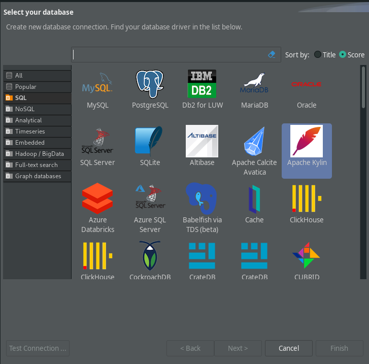
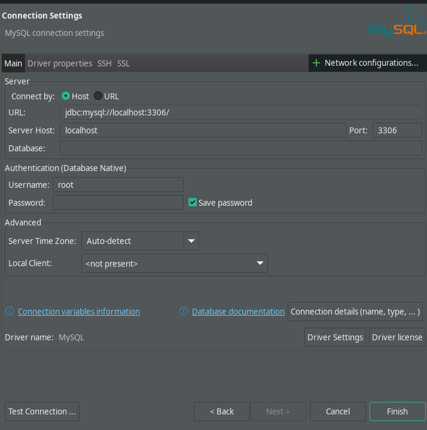
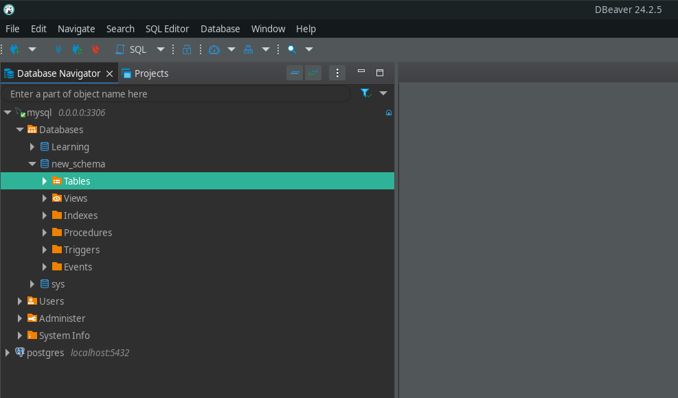
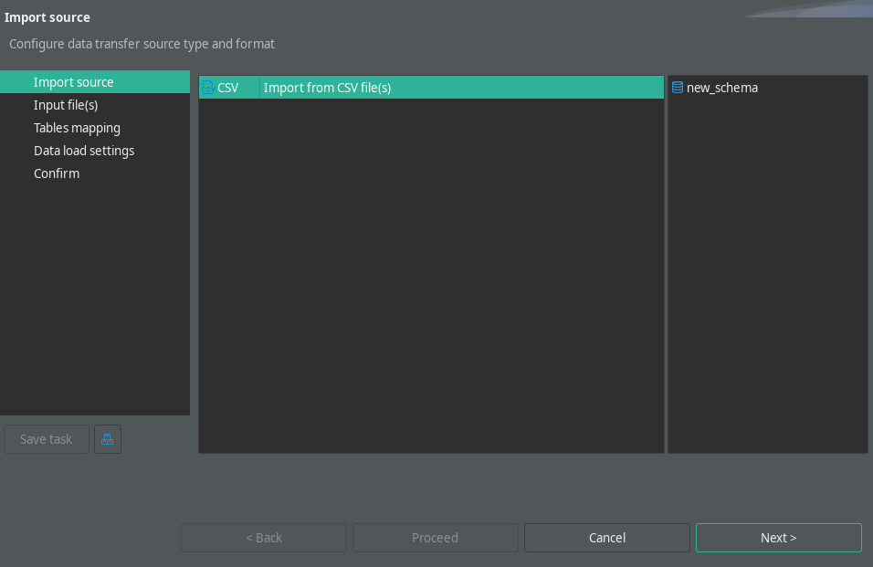
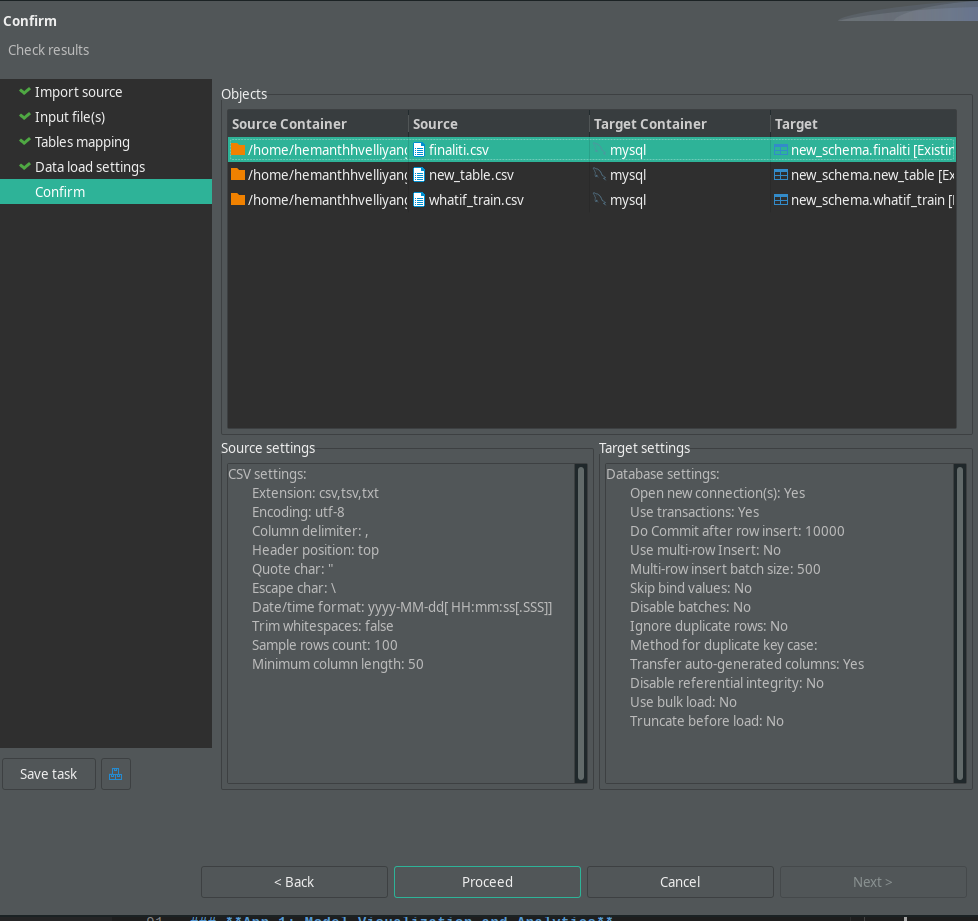
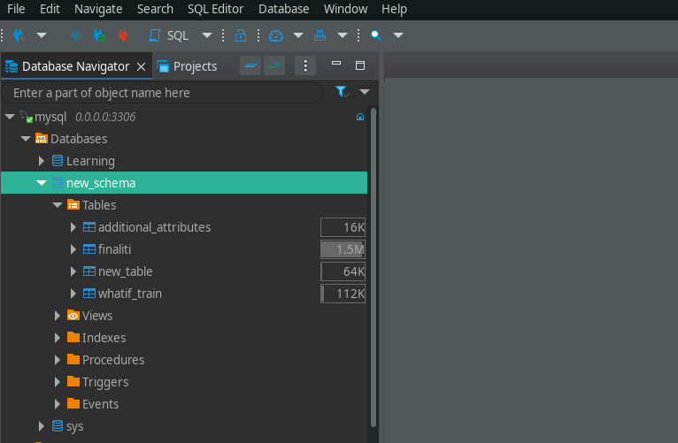

# Project Setup Guide

This guide outlines the steps to set up the project for local development and provides information about the two applications included in this repository.

`Note:` To Setup the DB locally you need to download the csv files from `csr_entire_project_hook/data`

---

## **1. Local Environment Setup**

### Create a Python Environment
1. Create a virtual Python environment:
   ```bash
   python -m venv env
   ```
2. Activate the environment:
   - **Windows**:
     ```bash
     .\env\Scripts\activate
     ```
   - **Mac/Linux**:
     ```bash
     source env/bin/activate
     ```
3. Install the required dependencies:
   ```bash
   pip install -r requirements.txt
   ```

---

## **2. Database Setup**

### Option 1: Install MySQL Locally
1. Download and install [MySQL](https://www.mysql.com/downloads/).
2. Configure your database settings.

### Option 2: Use MySQL with Docker
1. Pull the MySQL Docker image:
   ```bash
   docker pull mysql:latest
   ```
2. Run the container:
   ```bash
   docker run --name mysql-db -e MYSQL_ROOT_PASSWORD=yourpassword -e MYSQL_DATABASE=yourdatabase -p 3306:3306 -d mysql:latest
   ```

---

## **3. Database Management**

1. Use a database management tool (e.g., [DBeaver](https://dbeaver.io/)) to manage your database effectively.
(I am using DBeaver here)
2. Create a new DB connection [Shift + Ctrl + N]
3. Select MySQL

4. Make your DB configurations

5. Create your own Database ( here. `new_schema` ), right click on it and choose `Import Data`


6. Choose `CSV`


7. Click Browse and files `finaliti.csv`,`new_table.csv`,`whatif_train.csv` one by one and click proceed to apply changes.


8. You can see files in the DB

---

## **4. Configure Secrets**

1. Add your database credentials to the secrets file located at:
   ```
   webapp/.streamlit/secrets.toml
   ```
2. Example structure for the `secrets.toml` file:
   ```toml
   [database]
   host = "localhost"
   user = "yourusername"
   password = "yourpassword"
   database = "yourdatabase"
   ```

---

## **5. Applications Overview**

This repository contains two applications:

### **App 1: Model Visualization and Analytics**
- Built using **Streamlit**.
- Enables users to visualize and interact with the model and analytics.

### **App 2: Data Entry**
- Built using **Flask**.
- Used for entering data into the model.

---

## **6. Running the Applications**

### Run the Streamlit App
1. Use the following command to start the Streamlit application from base folder:
   ```bash
   cd webapp/ # move to the app folder
   ```
   ```bash
   stremalit run 01_ForeCaster-\[Old\ Patients\].py
   ```

### Run the Flask App
1. Use the following command to start the Flask application from base folder:
   ```bash
   cd sql_test/
   ```
   ```bash
   python app.py
   ```
